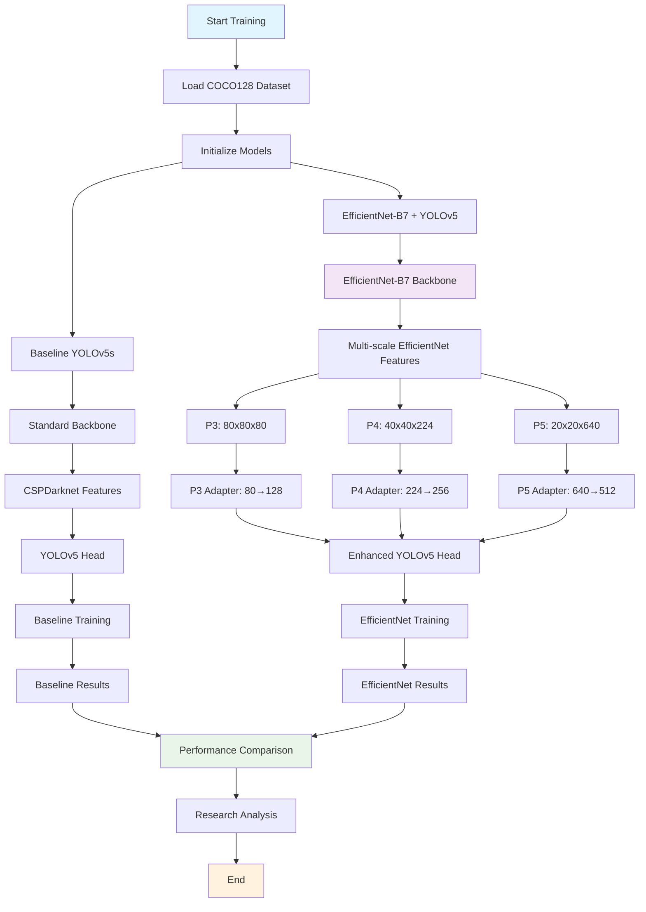
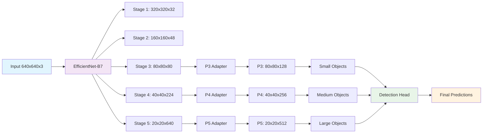
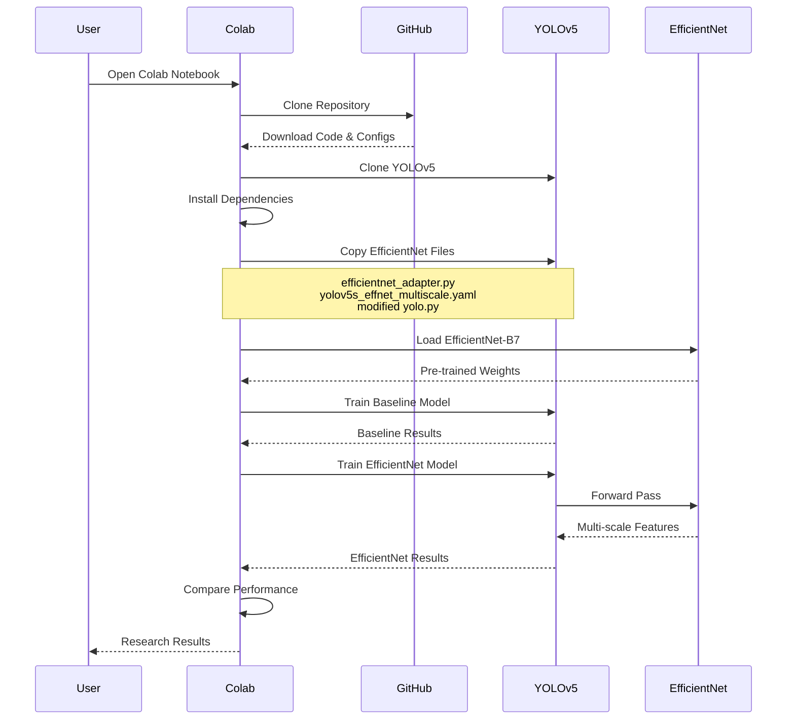
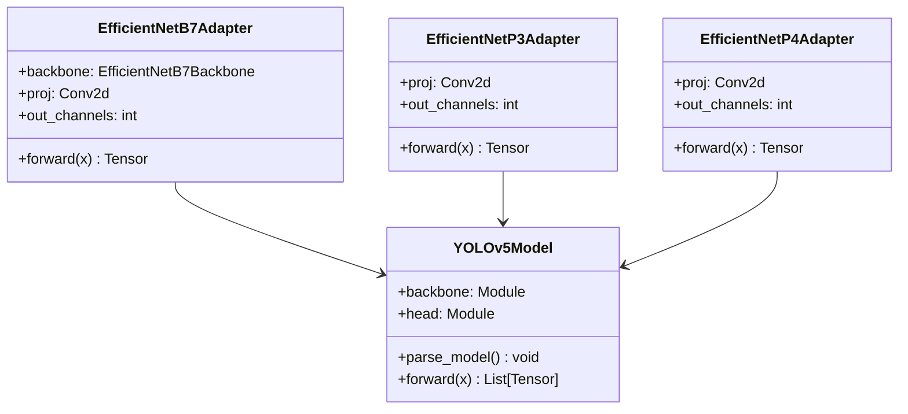
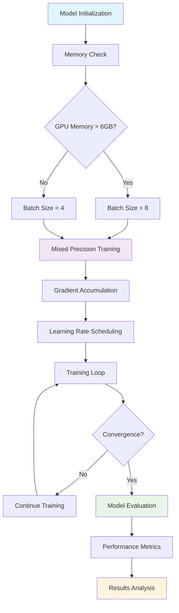
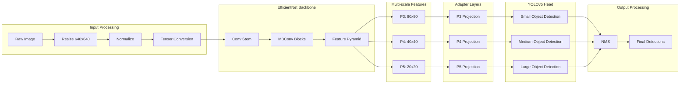
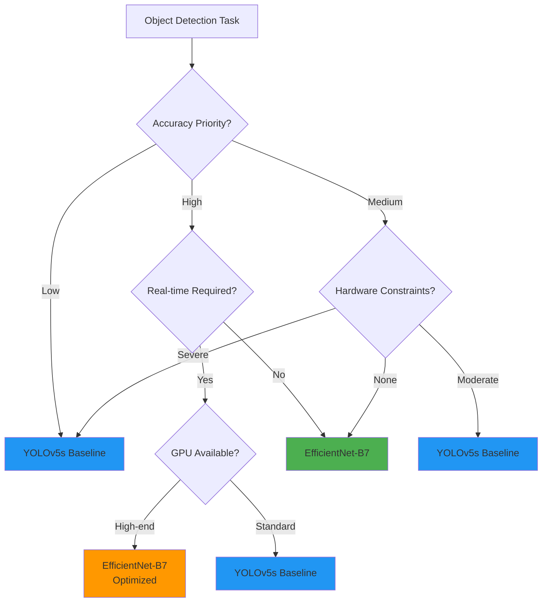

# 🏗️ Architecture Flow Documentation

## 📊 Complete System Architecture

### 🔄 Training Flow Chart

### 🧠 EfficientNet Integration Details

### ⚙️ Implementation Flow

## 🔧 Technical Implementation Details

### 📝 Code Structure Flow

### 🎯 Performance Optimization Flow

## 📊 Data Flow Analysis

### 🔄 Feature Extraction Pipeline

### 📈 Training Progress Flow

```mermaid
gantt
    title Training Timeline Comparison
    dateFormat X
    axisFormat %s
    
    section Baseline YOLOv5s
    Environment Setup    :done, setup1, 0, 2
    Model Loading       :done, load1, 2, 3
    Training (10 epochs):done, train1, 3, 11
    Evaluation          :done, eval1, 11, 12
    
    section EfficientNet-B7
    Environment Setup    :done, setup2, 0, 2
    Model Loading       :done, load2, 2, 5
    Training (10 epochs):done, train2, 5, 30
    Evaluation          :done, eval2, 30, 32
    
    section Analysis
    Results Comparison  :done, compare, 32, 35
    Documentation      :done, docs, 35, 37
```

## 🎯 Decision Tree for Model Selection

This comprehensive flow documentation provides visual representations of all major aspects of the YOLOv5 + EfficientNet-B7 integration research.
